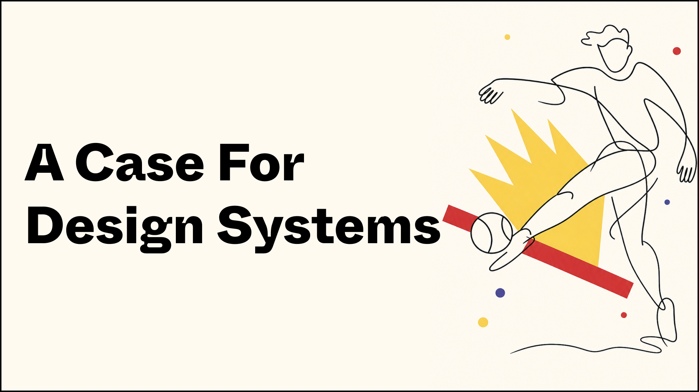
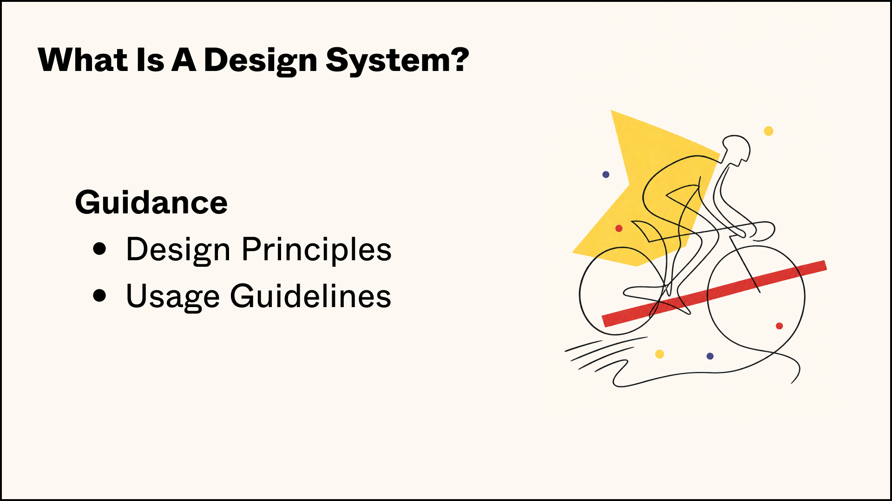
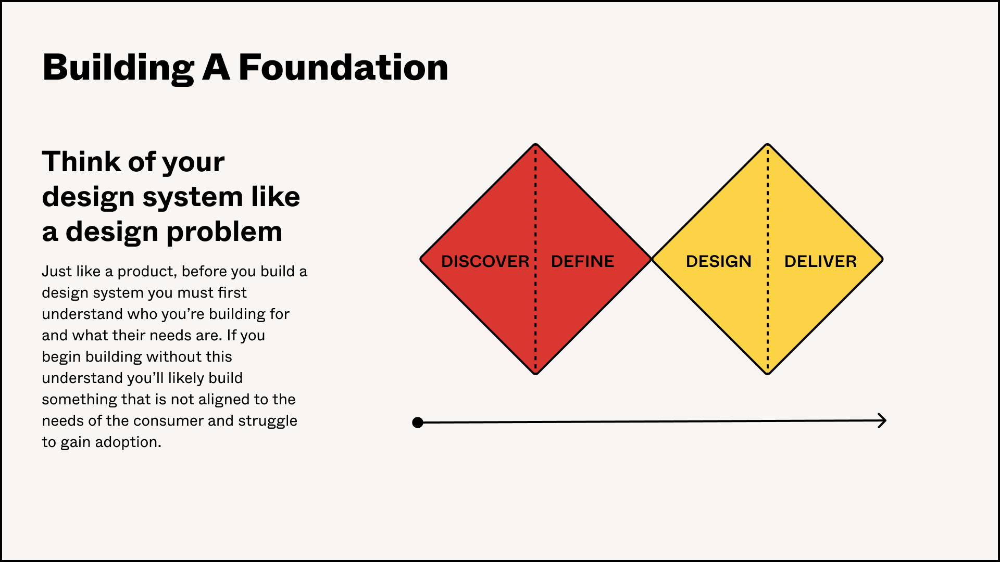
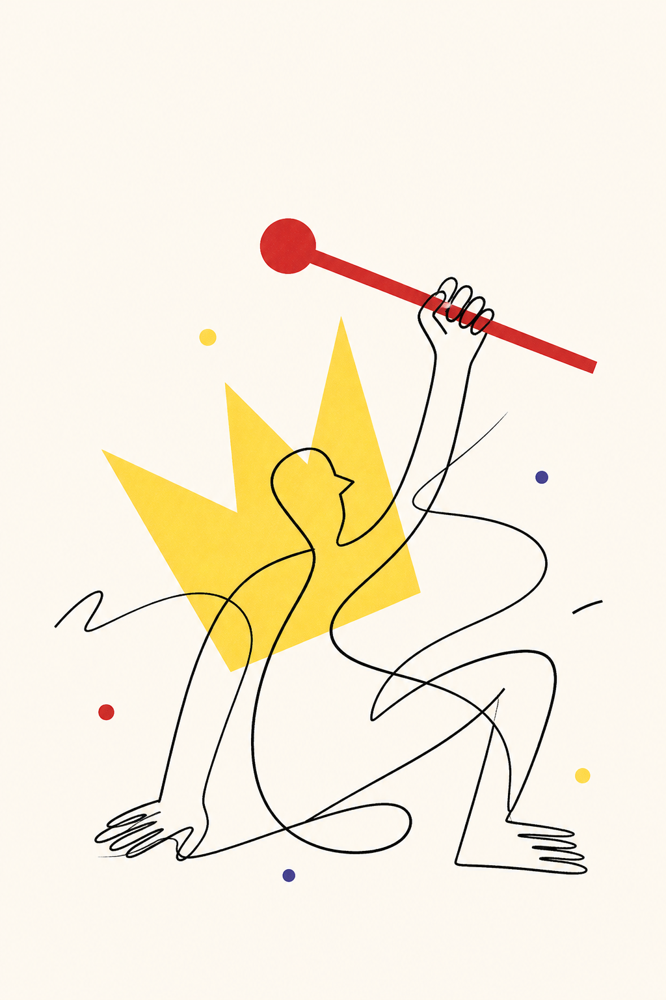
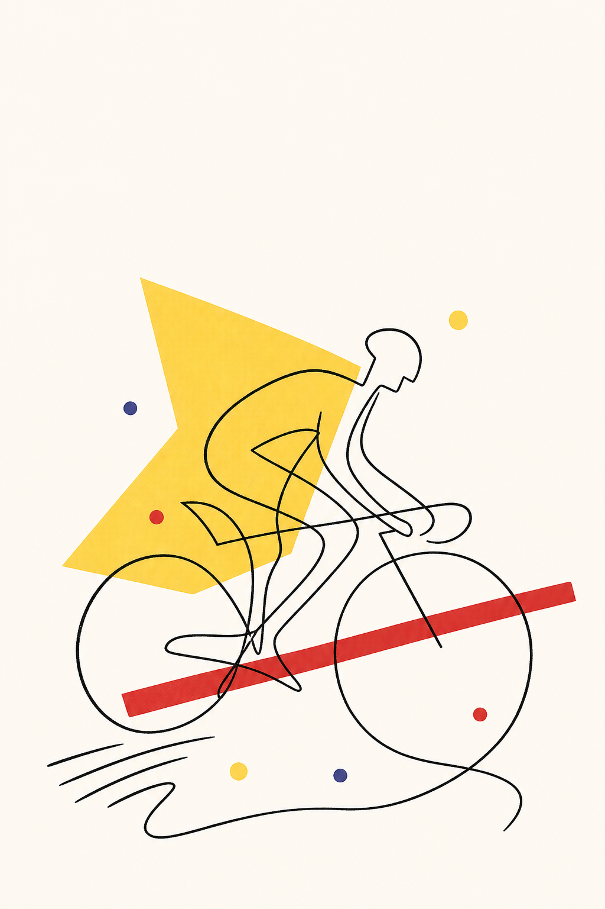

<div align="center">

# 大气的 PPT 配图 Skill

为微信文章和 PPT 生成统一、干净、有编辑感的线描插画。

<strong>细黑线人物 · 红黄几何色块 · 大面积留白 · 图像模型生成</strong>

<br>

<a href="#示例图">示例图</a> ·
<a href="#主要用途">主要用途</a> ·
<a href="#如何使用">如何使用</a> ·
<a href="#风格规范">风格规范</a>

</div>



## 项目介绍

`poster-line-illustrator` 是一个用于内容创作的 Codex Skill。它把文章主题、PPT 页标题、产品概念或抽象观点，转译成一张干净、有张力、适合排版的线描插画。

这个 Skill 不追求复杂场景，也不做写实图片。它的目标是让配图在微信文章和 PPT 里看起来更统一、更大气：一个主体动作、一个清晰隐喻、少量红黄视觉锚点，以及足够多的留白。

默认使用图像生成模型输出 raster 插画，不以 SVG 作为最终稿。

## 示例图

### PPT 页面效果

| 封面页 | 章节页 | 框架页 |
|---|---|---|
|  |  |  |

### 单图配图效果

| 文章主题 | 体育系列 | 风格参考 |
|---|---|---|
|  |  | 

## 主要用途

1. 微信文章配图
2. PPT 配图

也适合用于知识专栏、课程封面、产品说明页、活动主题页和系列化内容视觉，但核心场景始终是“内容表达的配图”，不是复杂信息图、UI 截图或品牌 logo。

## 如何使用

### 安装到 Codex

```bash
mkdir -p ~/.codex/skills
git clone https://github.com/ai798-Lab/poster-line-illustrator.git ~/.codex/skills/poster-line-illustrator
```

### 触发词

英文触发词：

```text
$poster-line-illustrator
```

中文触发词：

```text
大气的 PPT 配图
大气PPT配图
PPT配图
PPT插画配图
微信文章配图
公众号配图
红黄线描插画
极简线描人物插画
按这套 PPT 风格生成配图
用这个大气线描风格做配图
```

### 使用示例

```text
用大气的 PPT 配图风格，给“AI 产品战略”生成一张 16:9 PPT 配图，不要文字。
```

```text
用微信文章配图风格，给这篇文章生成三张配图，每张只表达一个核心观点。
```

```text
用 $poster-line-illustrator 给“OPC 的时代”生成一张大气、干净、有留白的文章头图。
```

## 风格规范

这个 Skill 只保留参考图里的插画语言，不复制参考图里的文字、标题、版式和具体人物。

| 维度 | 规范 |
|---|---|
| 主体 | 一位抽象线描人物、一只手，或一个简单动作 |
| 线条 | 细黑色连续轮廓线，允许轻微手绘感 |
| 色块 | 红色长条、圆点、道具；黄色皇冠、聚光、折纸、几何块 |
| 留白 | PPT 场景保留标题区和正文区，文章场景保留呼吸感 |
| 色彩 | 米白背景、黑线、红色、黄色，少量蓝紫点 |
| 禁止 | 复杂背景、写实照片、UI、logo、密集图表、过多人物 |

推荐结构：

```text
一个主体动作 + 一个核心道具 + 一个红/黄色大色块 + 少量彩点 + 大面积留白
```

## 输出建议

| 场景 | 推荐画幅 | 说明 |
|---|---|---|
| PPT 配图 | 16:9 横版 | 画面右侧或中部放插画，左侧保留标题和正文空间 |
| 微信文章头图 | 16:9 或 4:3 | 适合公众号首图、文章顶部视觉 |
| 文章段落插图 | 3:2 或 1:1 | 每张图只表达一个观点 |
| 海报/封面 | 3:4 或 2:3 竖版 | 用于课程封面、专栏封面、活动主题图 |

默认不在生成图里写文字。PPT 标题、正文和页码建议由 PPT 工具单独排版，避免图像模型生成不可控文字。

## 仓库结构

```text
poster-line-illustrator/
├── README.md
├── SKILL.md
├── agents/
│   └── openai.yaml
├── assets/
│   └── examples/
│       ├── poster-line-01.png
│       ├── poster-line-02.png
│       └── poster-line-03.png
├── examples/
│   ├── ppt-showcase/
│   ├── sports-set/
│   └── opc-era-poster-line.png
└── references/
    ├── style-dna.md
    ├── visual-grammar.md
    ├── theme-translation.md
    ├── prompt-template.md
    └── qa-checklist.md
```

## 质量检查

生成后用这几个问题判断是否合格：

- 是否一眼能看出只表达一个主题？
- 是否有足够留白，能放进微信文章或 PPT 页面？
- 是否保留了细黑线、红黄大色块和少量彩点？
- 是否避免了复杂背景、写实场景和企业官网插画感？
- 是否没有生成乱码文字、logo、UI 或图表？

## 许可

暂未指定。公开使用或分发前，请根据项目需要补充许可证。
