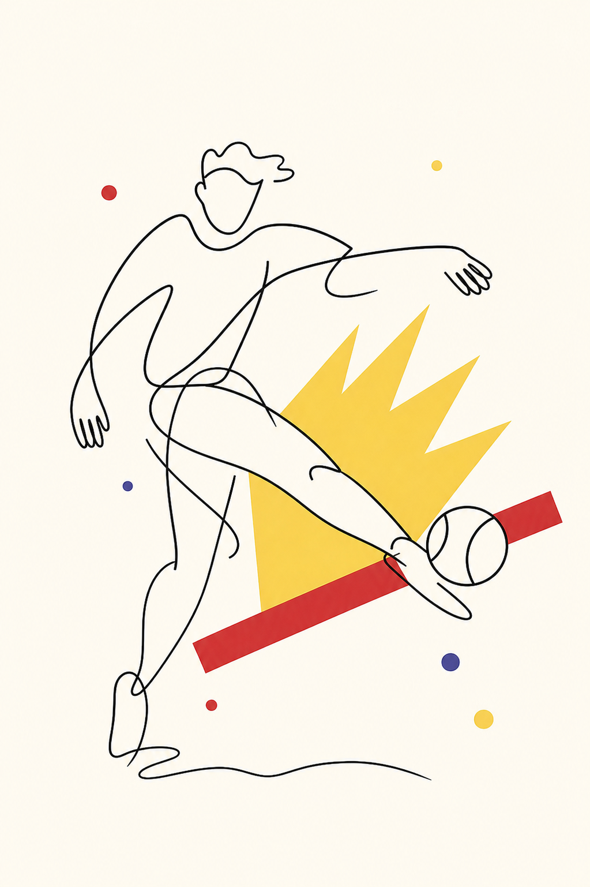
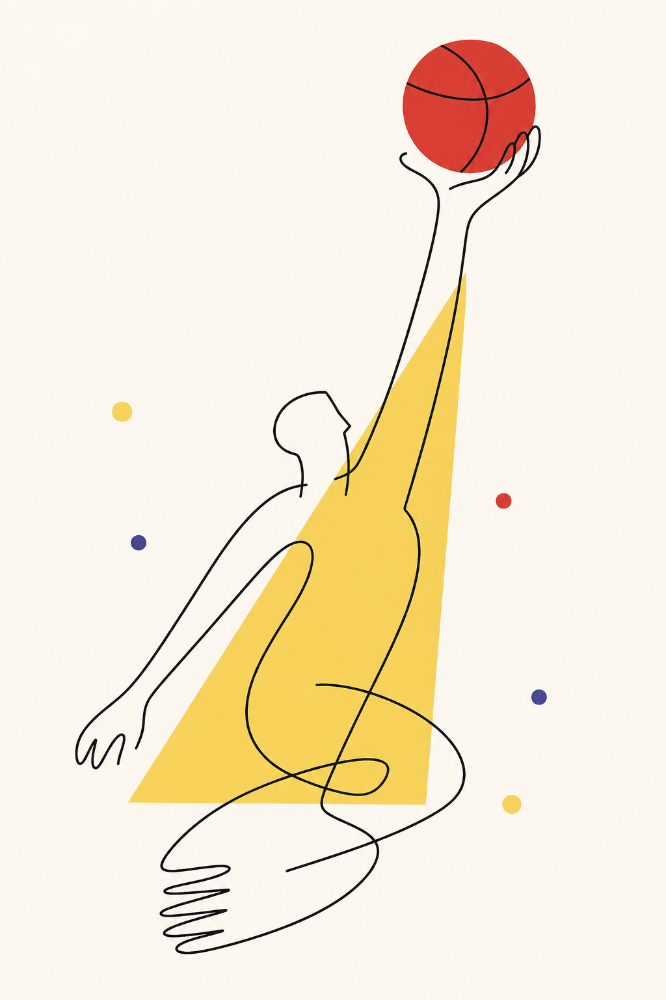
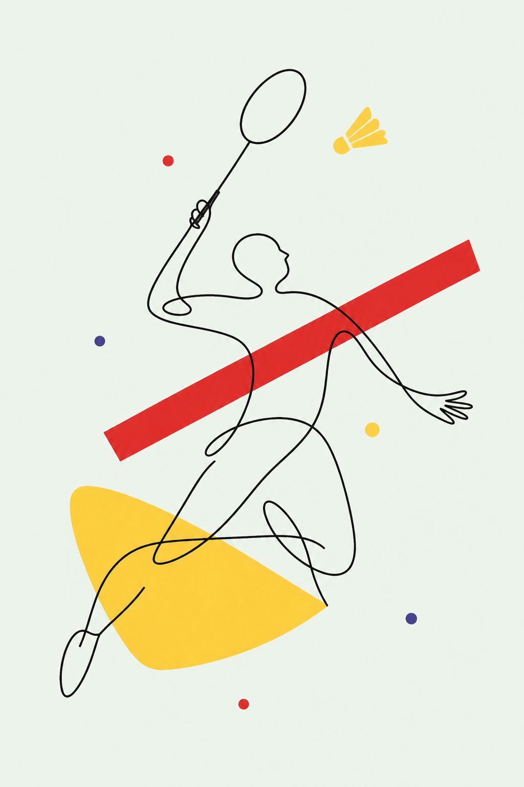
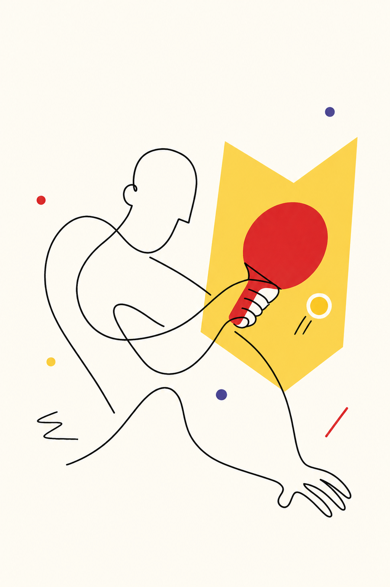
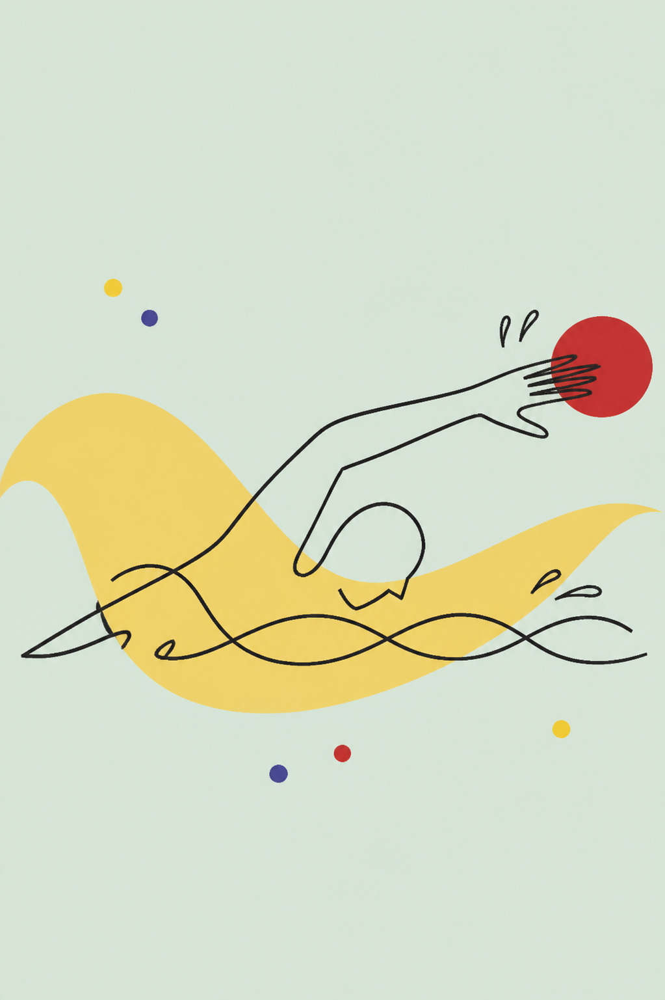

# Poster Line Illustrator

海报线描插画 Skill。根据一个主题，生成类似参考海报的图像模型插画：细黑线人物、红黄大色块、少量彩点、强留白、轻微超现实的编辑海报感。

这个 Skill 默认使用图像生成模型输出 raster 插画，不以 SVG 作为最终稿。

## 项目介绍

`poster-line-illustrator` 用于把文章主题、活动主题、产品概念或抽象命题转译成一张统一风格的插画。

它重点控制四件事：

- 只学习参考图里的插画风格，忽略所有文字排版
- 用一位抽象线描人物或一只手作为主体
- 用红色道具和黄色几何块表达主题隐喻
- 用大量留白和少量彩点保持海报感

适合：

- 公众号文章配图
- 主题海报插画
- 系列栏目视觉
- 运动、科技、商业、个人品牌主题图
- 需要统一风格的批量插画

不适合：

- 写实照片
- UI 界面图
- 信息图表
- logo 设计
- 复杂场景叙事

## 示例图

### OPC 的时代


### 体育项目系列

| 足球 | 篮球 | 羽毛球 |
|---|---|---|
|  |  |  |

| 乒乓球 | 游泳 | 骑行 |
|---|---|---|
|  |  |  |

## 如何使用

### 安装到 Codex

把这个仓库克隆到 Codex skills 目录：

```bash
mkdir -p ~/.codex/skills
git clone https://github.com/ai798-Lab/poster-line-illustrator.git ~/.codex/skills/poster-line-illustrator
```

### 触发方式

英文触发词：

```text
$poster-line-illustrator
```

中文触发词：

```text
海报线描插画
线描海报风格
手绘线条海报
红黄线描插画
极简线描人物插画
按那组三张海报风格画图
用那个红黄线条插画风格生成
用之前 OPC 那张图的风格生成
```

### 使用示例

```text
用海报线描插画风格，给“OPC 的时代”生成一张图。
```

```text
用 $poster-line-illustrator 给足球、篮球、羽毛球、乒乓球、游泳、骑行各生成一张系列插画。
```

```text
按线描海报风格，给这篇文章配一张封面插画，不要文字。
```

## 风格规则

核心视觉规则：

- 竖版海报构图
- 一位抽象线描人物或一只手
- 细黑色连续轮廓线
- 红色用于权杖、控制杆、信号、球、强调点
- 黄色用于皇冠、聚光、折纸、地图、时代感色块
- 少量蓝紫/红/黄彩点
- 背景为米白或淡薄荷色
- 无文字、无 logo、无 UI、无图表

## 目录结构

```text
poster-line-illustrator/
├── README.md
├── SKILL.md
├── agents/
│   └── openai.yaml
├── assets/
│   └── examples/
│       ├── poster-line-01.png
│       ├── poster-line-02.png
│       └── poster-line-03.png
├── examples/
│   ├── opc-era-poster-line.png
│   └── sports-set/
├── references/
│   ├── style-dna.md
│   ├── visual-grammar.md
│   ├── theme-translation.md
│   ├── prompt-template.md
│   └── qa-checklist.md
```

## 生成原则

每张图只表达一个主题，不要把所有关键词都画出来。

推荐结构：

```text
一个抽象人物 + 一个核心道具 + 一个红/黄色大色块 + 少量彩点
```

失败信号：

- 看起来像信息图
- 看起来像企业官网插画
- 出现文字或 logo
- 出现复杂背景
- 出现真实场景、办公室、城市、团队或详细服装
- 画面元素过多，失去留白

## 许可

暂未指定。公开使用或分发前，请根据项目需要补充许可证。
